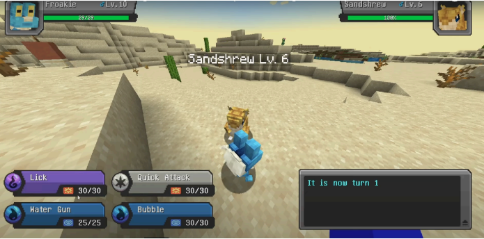
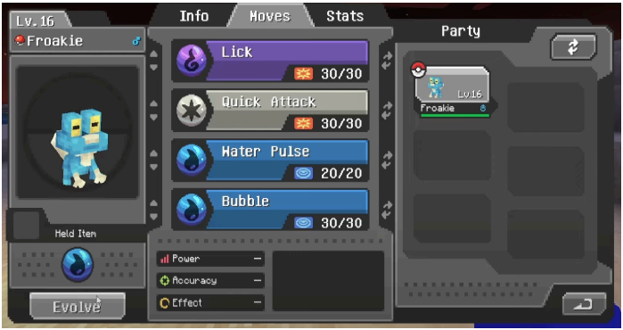

Aqui está a transcrição da atividade **PTOSS-2** em formato **Markdown**, conforme solicitado:

---

# Prática de Teste em OSS 2 – Desenvolver Testes Funcionais/Sistema Caixa-Preta

## Enunciado

### Objetivo:
Realizar testes Caixa-Preta no nível Funcional/Sistema na aplicação OSS.

### Instruções:

1. Identificar as funcionalidades da aplicação. Cada membro da equipe deve escolher uma funcionalidade distinta dos demais. A funcionalidade deve ser adequada para o teste caixa-preta e minimamente complexa para gerar ao menos 6 casos de teste.
2. Analisar a funcionalidade e identificar as condições de entrada e as condições de saída.
3. Usar o bom senso para fazer suposições caso informações claras sobre os requisitos não sejam encontradas.
4. A partir das condições de entrada e de saída, analisar as partições, identificando as classes de equivalência válidas e inválidas.
5. Analisar os valores limites de todas as partições.
6. Escrever casos de teste cobrindo o máximo de classes válidas, usando os valores limites.
7. Escrever um caso de teste para cada classe inválida, usando os valores limites.
8. Executar os casos de teste e reportar os resultados da execução.
9. Se alguma falha for identificada, ela deve ser reportada ao projeto e o estudante poderá ganhar 0,5 ponto extra por falha registrada.

### Entrega:
Relatório, conforme modelo, contendo as seguintes informações:

- Identificação do projeto e da funcionalidade escolhida.
- Especificação de requisitos elaborada a partir das informações coletadas sobre a funcionalidade.
- Tabela com as condições de entrada e saída, identificando e numerando as classes válidas e inválidas.
- Especificação dos casos de teste, apresentando:
  - Número do caso de teste.
  - Título do caso de teste.
  - Quais classes de equivalência estão sendo cobertas.
  - Dados de entrada.
  - Saída esperada.
  - Procedimento para executar o teste (passo a passo).
- Execução dos testes, apresentando:
  - Capturas de tela mostrando a execução dos testes.
  - Resultado da execução (sucesso ou falha).
- Conclusão sobre a qualidade da funcionalidade com base nos testes realizados.

---

## Resolução

### 1. Identificação da Aplicação

- **Nome do Projeto**: Cobblemon
- **Descrição**: Cobblemon é um mod para Minecraft que integra elementos do universo Pokémon, permitindo que os jogadores capturem, treinem e batalhem com criaturas no ambiente do jogo. O mod adiciona novas mecânicas e funcionalidades inspiradas na série Pokémon.

---

### 2. Especificação da Funcionalidade

**Funcionalidade**: Evolução de Pokémon  
**Descrição**: A funcionalidade de evolução permite que os Pokémon capturados pelos jogadores evoluam para formas mais avançadas, ao cumprir certas condições, como atingir um nível específico ou usar um item especial.

#### Captura de Tela:

### 3. Condições de Entrada e Saída

| ID  | Condição de Entrada              | Condição de Saída               | Classe  |
|-----|----------------------------------|---------------------------------|---------|
| 1   | Growlithe + Fire Stone           | Growlithe evolui para Arcanine  | Válida  |
| 2   | Pikachu + Thunder Stone          | Pikachu evolui para Raichu      | Válida  |
| 3   | Eevee + Water Stone              | Eevee evolui para Vaporeon      | Válida  |
| 4   | Magikarp nível 20                | Magikarp evolui para Gyarados   | Válida  |
| 5   | Magikarp nível 19                | Magikarp não evolui             | Inválida|
| 6   | Pikachu + Water Stone            | Pikachu não evolui              | Inválida|
| 7   | Arcanine nível 100               | Arcanine não evolui             | Inválida|

---

### 4. Especificação dos Casos de Teste

| CT  | Descrição                            | Condição Inicial               | Condição Esperada                 | Classe  |
|-----|--------------------------------------|--------------------------------|-----------------------------------|---------|
| CT-01 | Evolução de Growlithe ao usar Fire Stone | Growlithe + Fire Stone        | Growlithe evolui para Arcanine    | Válida  |
| CT-02 | Evolução de Pikachu ao usar Thunder Stone | Pikachu + Thunder Stone      | Pikachu evolui para Raichu        | Válida  |
| CT-03 | Evolução de Eevee ao usar Water Stone | Eevee + Water Stone          | Eevee evolui para Vaporeon        | Válida  |
| CT-04 | Evolução de Magikarp ao atingir nível 20 | Magikarp nível 19            | Magikarp evolui para Gyarados     | Válida  |
| CT-05 | Verificar se Magikarp não evolui com nível 19 | Magikarp nível 19           | Magikarp não evolui              | Inválida|
| CT-06 | Verificar se Pikachu não evolui com Water Stone | Pikachu + Water Stone       | Pikachu não evolui               | Inválida|

---

### 5. Execução dos Testes

#### Captura de Tela:

| CT  | Resultado Esperado                | Resultado Obtido              | Status  |
|-----|-----------------------------------|--------------------------------|---------|
| CT-01 | Growlithe evolui para Arcanine    | Growlithe evoluiu para Arcanine | Aprovado|
| CT-02 | Pikachu evolui para Raichu        | Pikachu evoluiu para Raichu     | Aprovado|
| CT-03 | Eevee evolui para Vaporeon        | Eevee evoluiu para Vaporeon     | Aprovado|
| CT-04 | Magikarp evolui para Gyarados     | Magikarp evoluiu para Gyarados  | Aprovado|
| CT-05 | Magikarp não evolui               | Magikarp não evoluiu            | Aprovado|
| CT-06 | Pikachu não evolui                | Pikachu não evoluiu             | Aprovado|

---

### 6. Conclusão

Os testes realizados na funcionalidade de evolução do Pokémon no mod Cobblemon confirmaram que a implementação está correta. Todas as evoluções ocorreram conforme esperado para as condições válidas, e nenhuma evolução ocorreu para as condições inválidas. A funcionalidade de evolução se mostrou robusta e consistente, proporcionando uma experiência de jogo fiel ao universo Pokémon.